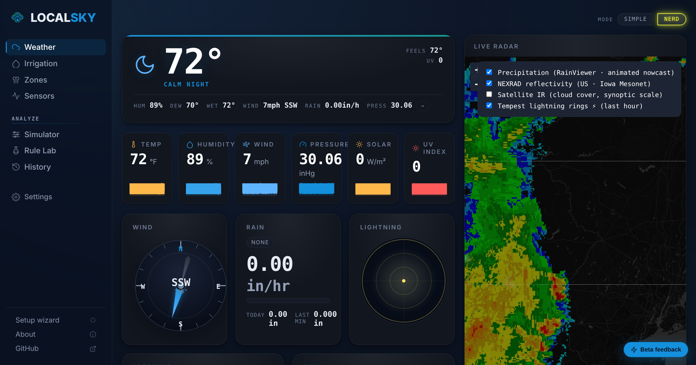
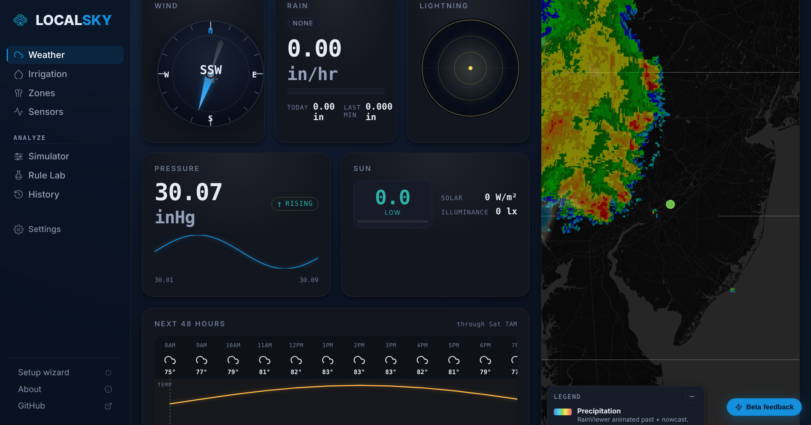
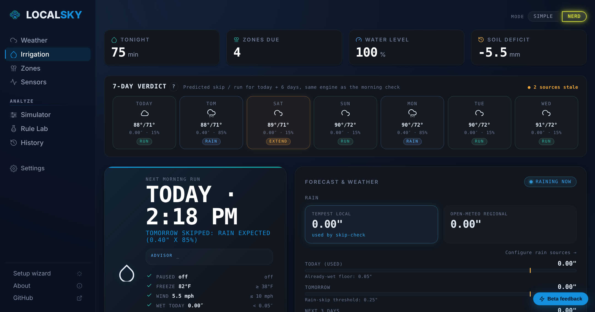
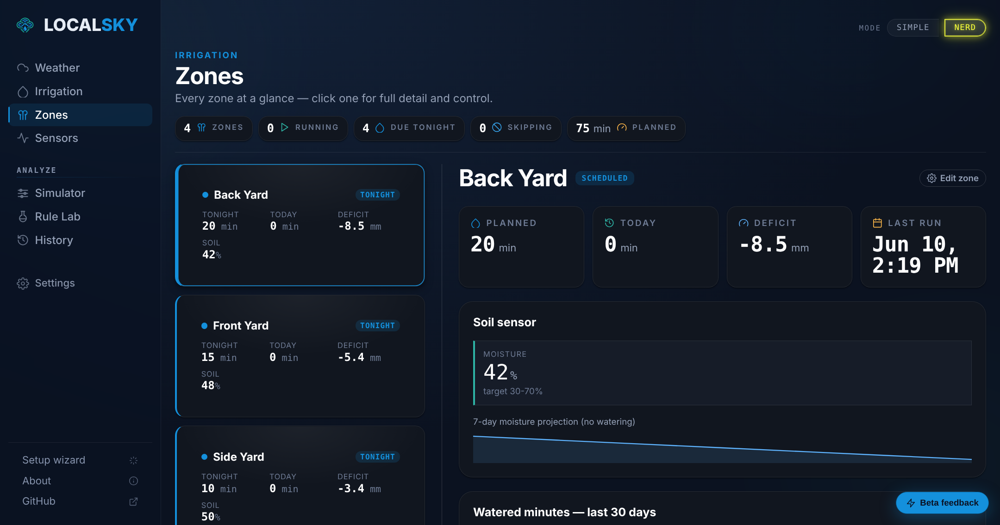
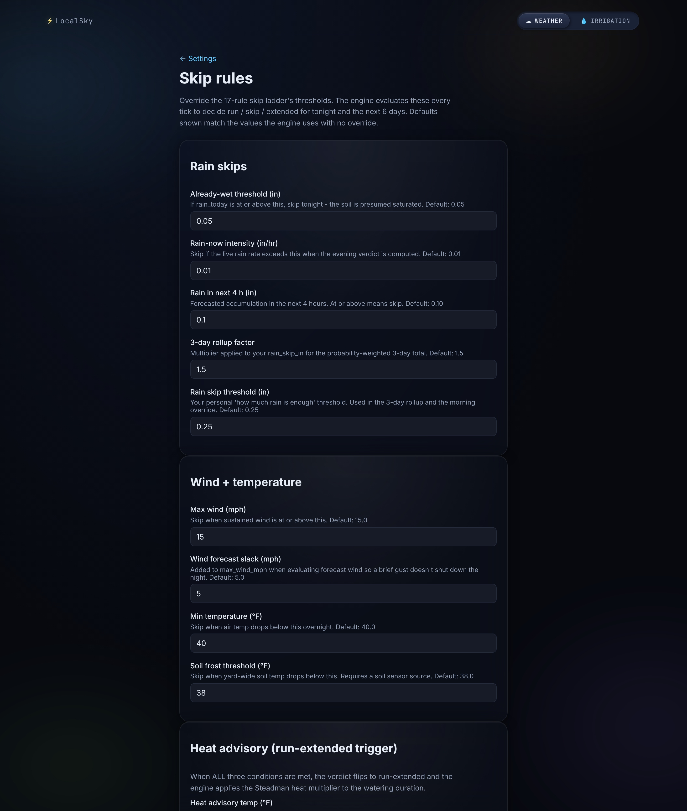
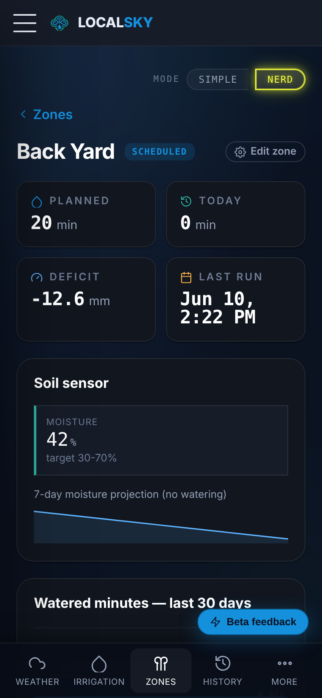
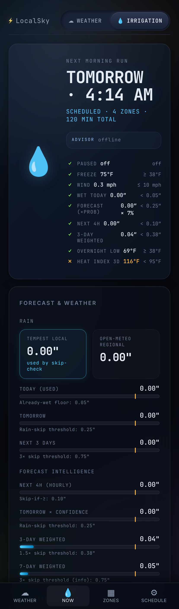

<p align="center">
  
</p>
<h1 align="center">LOCALSKY</h1>

<p align="center">
  <strong>Hyperlocal weather on your hardware. Smart irrigation when you want it.</strong><br>
  Self-hosted, open source, no cloud, no subscription, no account.
</p>

<p align="center">
  <strong><a href="https://localsky.io">localsky.io</a></strong> &nbsp;&middot;&nbsp;
  <a href="https://localsky.io/docs/">Documentation</a> &nbsp;&middot;&nbsp;
  <a href="https://demo.localsky.io">Live demo</a>
</p>

<p align="center">
  <a href="LICENSE"></a>
  <a href="https://www.rust-lang.org/"></a>
  <a href="https://leptos.dev/"></a>
  <a href="https://localsky.io"></a>
  <a href="https://localsky.io/docs/"></a>
  <a href="https://github.com/silenthooligan/localsky/releases"></a>
</p>

<p align="center">
  
</p>

LocalSky is two products in one Docker container.

**A self-hosted weather dashboard** that reads your Tempest or Ecowitt station over the LAN, blends in worldwide and regional forecasts with per-field provenance (Open-Meteo everywhere, with NWS, MET Norway, OpenWeather, and Pirate Weather as alternatives), and renders it in a fast, installable PWA in metric or imperial units. The built-in radar map is global: worldwide precipitation playback, high-resolution national reflectivity (United States, Canada, Germany, Finland, and more), tropical-cyclone tracking across every basin, animated wind flow, and lightning. Useful on its own, even if you never irrigate anything.

**A smart irrigation engine** that pairs the same weather data with peer-reviewed agronomy (FAO-56 reference ET, USDA soil textures, species-aware Kc curves, a 17-rule skip ladder) and drives OpenSprinkler, ESPHome, or Home Assistant. Optional. Off until you wire a controller.

Home Assistant is supported as a peer, never required. Everything runs on your own hardware. A worldwide forecast (Open-Meteo) is the only optional outbound call, and you can choose the national weather model behind it, swap it for NWS (US), MET Norway, OpenWeather, or Pirate Weather, or blend several sources with per-field provenance.

## Why LocalSky

Most hyperlocal weather products are cloud tethered. Tempest's web app, Ambient Weather Network, Weather Underground, Ecowitt's ecowitt.net, all of them want an account, an internet connection, and an indefinite right to your station's data. LocalSky reads the same hardware over UDP or LAN, persists every observation locally, and renders the dashboard from your own browser, all without phoning home.

Most home irrigation systems are either dumb timers or cloud tethered too. The cloud ones see weather radar but not your sprinkler's actual flow rate, your soil texture, your grass species, or the specific shade your back fence throws across the side yard at 3 p.m. on a midsummer afternoon. LocalSky is built around the assumption that *you* know your yard, and the software's job is to listen to your live sensors, apply published meteorological and soil science, and give you a clear answer to "should I water tonight?"

## Screenshots

<p align="center">
  <br>
  <em>Live radar map: a region-aware provider catalog (worldwide precipitation, national high-resolution reflectivity), tropical-cyclone tracking, animated wind flow, alerts, and lightning, all behind one Layers panel</em>
</p>

<p align="center">
  <br>
  <em>Irrigation page (optional): 7-day verdict strip, next-run card, full skip-rule breakdown, water budget, and live forecast intelligence</em>
</p>

<p align="center">
  <br>
  <em>Manual zone controls: idle / running badge per zone, planned / today / bucket readouts, and 10 / 30 / 60-minute quick-run buttons. Running zones swap to a single red STOP.</em>
</p>

<table>
  <tr>
    <td align="center" width="50%">
      <br>
      <em>Override every threshold in the skip ladder: rain, wind, freeze, soil frost, extreme heat (heat-index threshold). Defaults shown inline; engine picks up new values on the next tick.</em>
    </td>
    <td align="center" width="50%">
      <br>
      <em>First-run wizard: full 13-species grass catalog, photo cards with Kc range, root depth, and MAD per species, ready out of the box.</em>
    </td>
  </tr>
</table>

<table>
  <tr>
    <td align="center" width="50%">
      <br>
      <em>Mobile zone detail: status, 30-day history chart, FAO-56 math chain, run history</em>
    </td>
    <td align="center" width="50%">
      <br>
      <em>Mobile irrigation page: next-run hero, advisor card, forecast breakdown</em>
    </td>
  </tr>
</table>

## Features

### Weather dashboard

- **Live station observations** from Tempest WeatherFlow over UDP 50222 (rapid wind, obs, lightning, battery)
- **Ecowitt LAN ingestion** for the GW1100 / GW2000 family and any attached WH51 / WH52 soil probes
- **Multi-source forecast merge** with per-field provenance and a selectable national weather model (Open-Meteo, MET Norway, OpenWeather, and Pirate Weather worldwide; NWS in the US; plus generic MQTT subscribe and HTTP webhook for custom sources anywhere)
- **Global radar map** with a region-aware provider catalog: RainViewer precipitation worldwide; high-resolution national reflectivity (NEXRAD and nowCOAST in the US, Environment Canada, Germany's DWD, Finland's FMI, more easily added); worldwide tropical-cyclone tracking across all basins (NHC, JMA, JTWC); animated wind flow; NWS alert overlays; satellite imagery; and opt-in Blitzortung community lightning
- **Hourly + daily forecast** with rain probability, wind, dew point, apparent temperature, solar irradiance, UV index
- **Historical persistence** via local SQLite, with the verdict-history table replayable through the current engine

### Irrigation engine (optional)

- **Native FAO-56 Penman-Monteith** reference ET with ASCE-EWRI 2005 simplified and Hargreaves-Samani 1985 fallbacks
- **Single-bucket water balance** with TAW / RAW / MAD per zone; depletion-driven scheduling
- **Cycle-and-soak** infiltration splitter that respects soil texture and slope
- **13-species grass catalog** with monthly, hemisphere-shifted Kc curves: warm-season (Bermuda, Zoysia, Kikuyu, St. Augustine, Bahia, Centipede), cool-season (Kentucky bluegrass, tall fescue, perennial ryegrass), plus ornamental shrubs, vegetable garden, and drip / xeriscape
- **7-class soil texture catalog** (USDA texture classes, the standard used internationally) with field capacity, wilting point, available water, and slope-graded infiltration
- **17-rule skip ladder** with configurable thresholds: rain now, rain next 4 h, probability-weighted 3-day and 7-day rollups, freeze, soil saturation, soil frost, extreme heat (heat-index threshold), high wind
- **7-day forward verdict strip**, the same engine that decides today, projected forward

### Controllers and integrations

- **Multi-controller HAL**: OpenSprinkler direct, HA service call, ESPHome native (community), Rachio cloud (planned), DryRun for demo and tests
- **Home Assistant optional**: a native [HACS integration](https://localsky.io/docs/hacs) with zeroconf discovery and sub-second push entities, plus outbound MQTT discovery for integration-free setups
- **Standalone sensor paths** (no HA needed): MQTT subscribe with JSON-path extraction, Ecowitt gateway local POST, and a generic HTTP webhook ingester for ESPHome or custom scripts
- **Local LLM advisor**: Ollama auto-detect, llama.cpp, OpenAI-compatible (LM Studio, vLLM, any private gateway). Optional, never required.

### UI and operability

- **Installable PWA** on iOS, Android, and desktop with VAPID-signed push notifications
- **Metric or imperial units**, system-wide or per field (temperature, wind, rainfall), so the dashboard reads naturally wherever you are
- **Built-in authentication**: owner account, sessions, and show-once API tokens for integrations; trusted-network CIDRs keep the home LAN frictionless while remote access requires sign-in
- **Network discovery**: one-click setup finds your Tempest broadcast, Ecowitt gateways, and OpenSprinkler on the LAN; LocalSky announces itself over mDNS so Home Assistant discovers it right back
- **First-run wizard** + in-app settings; no editing config files by hand (address search, timezone autofill, live controller test + zone import)
- **One-file backup and restore**: config plus full history database as a single bundle, downloadable from Settings
- **Opt-in update check** (off by default; nothing phones home unless you turn it on)
- **Versioned JSON schema** published at `/api/config/schema` for the settings UI
- **Atomic config writes** with snapshot-before-write retention and always-reachable rollback endpoint
- **Versioned SQLite migrations** with engine-replay history (stored verdict inputs replay through the current rules)
- **Demo mode** (`LOCALSKY_DEMO=1`) ships with synthetic Tempest / forecast / irrigation streams so the UI is fully populated out of the box
- **Dark glass-morphism design** with claymorphic accents, full mobile + desktop parity

## Quick start

```bash
docker run -d \
  --name localsky \
  -p 8090:8090 \
  -v localsky-data:/data \
  -e LOCALSKY_DEMO=1 \
  ghcr.io/silenthooligan/localsky:latest
```

Visit <http://localhost:8090>. The `LOCALSKY_DEMO=1` flag boots with simulated data so you can explore the UI before connecting any hardware.

For a real install, drop `LOCALSKY_DEMO`, mount your config volume, and visit `/setup`. The first-run wizard walks you through location, weather sources, controllers, and zones. See [the quick start](https://localsky.io/docs/getting-started) for a full walkthrough.

If you only want the weather dashboard, leave the controllers list empty in the wizard. LocalSky will skip the irrigation surfaces entirely and run as a pure weather product.

### Using Home Assistant?

LocalSky stays the brain; Home Assistant gets the entities. Install the companion integration and a running LocalSky is discovered automatically, with sub-second push updates, a full weather entity, zone valves, and irrigation services:

[](https://my.home-assistant.io/redirect/hacs_repository/?owner=silenthooligan&repository=localsky-hacs&category=integration)

On Home Assistant OS or Supervised, the LocalSky server itself can also run as a one-click app instead of a separate Docker host:

[](https://my.home-assistant.io/redirect/supervisor_add_addon_repository/?repository_url=https%3A%2F%2Fgithub.com%2Fsilenthooligan%2Flocalsky-apps)

## Hardware compatibility

| Category | Device | Status |
|---|---|---|
| Weather | Tempest WeatherFlow (UDP LAN) | Tested |
| Weather | Open-Meteo (global) | Tested |
| Weather | NWS (US) | Tested |
| Weather | MET Norway (global) | Tested |
| Weather | OpenWeather (global) | Tested |
| Weather | Pirate Weather (global) | Tested |
| Weather | Ambient Weather Network | Tested |
| Weather | Tempest Cloud WebSocket | Tested |
| Weather | Ecowitt GW1100 / GW2000 LAN (push, local-API poll, UDP autodiscovery) | Tested |
| Soil | Ecowitt WH51 / WH52 (via GW1x00) | Tested |
| Soil | Any MQTT-published soil sensor | Tested |
| Controller | OpenSprinkler firmware 2.1.9+ | Tested |
| Controller | OpenSprinkler Pi | Tested |
| Controller | HA Irrigation Unlimited passthrough | Tested |
| Controller | ESPHome sprinkler component | Community |
| Controller | Rachio Gen 2 / 3 cloud | Planned |
| LLM | Ollama (any tool-capable model) | Tested |
| LLM | llama.cpp HTTP server | Community |
| LLM | OpenAI / Anthropic compatible | Tested |
| LLM | vLLM | Tested |
| LLM | LM Studio | Community |
| Push | Web Push (VAPID) | Tested |
| Push | ntfy.sh / Slack webhook | Planned |

Promote to **Tested** only when CI fixture or maintainer-confirmed run exists.

## Documentation

Full docs live in [`docs/`](docs/) and are built into an mdBook for online viewing. Start here:

- [Getting started](https://localsky.io/docs/getting-started), install, prerequisites, and first-run walkthrough
- [Standalone mode](https://localsky.io/docs/standalone), the full no-Home-Assistant path
- [Controllers](https://localsky.io/docs/controllers), OpenSprinkler deep-dive plus alternatives
- [Sensors](https://localsky.io/docs/sensors), what each sensor type unlocks
- [Configuration reference](https://localsky.io/docs/configuration), every `localsky.toml` field
- [API reference](https://localsky.io/docs/api), REST + SSE endpoints, JSON shapes
- [Irrigation engine](https://localsky.io/docs/irrigation-engine), FAO-56 walkthrough with citations
- [Grass species](https://localsky.io/docs/grass-species) and [soil textures](https://localsky.io/docs/soil-textures)
- [Skip rules](https://localsky.io/docs/skip-rules), every rule in the ladder, explained
- [HACS integration](https://localsky.io/docs/hacs), pairing Home Assistant with a running LocalSky
- [UX journey](https://localsky.io/docs/ux-journey), first-run, upgrades, hardware changes, config changes

## Architecture at a glance

LocalSky is a Rust + Leptos full-stack PWA. The SSR server is a single statically-linked binary; the WASM client hydrates the streamed HTML. The internal layout follows a ports-and-adapters shape so every external system is swappable.

```
engine/        FAO-56 ET0, water balance, cycle-and-soak, skip rules (pure functions, no I/O)
ports/         WeatherSource, IrrigationController, LlmProvider, NotificationSink, ConfigStore
sources/       Tempest UDP, Open-Meteo, Ecowitt LAN, MQTT subscribe, HTTP webhook, demo replay
controllers/   OpenSprinkler direct, HA service call, DryRun
llm/providers/ Ollama, OpenAI-compatible (covers LM Studio, vLLM, llama.cpp /v1, private gateways)
ha/            Optional MQTT discovery publisher + opt-in REST passthrough
persistence/   Hand-rolled SQLite migrations, runs / sensor_history / verdict_history / config_snapshots
api/           Axum routes for snapshot, irrigation, forecast, config, wizard, health, LLM
components/    Leptos UI primitives plus the irrigation, forecast, weather, and settings surfaces
```

## Roadmap

**Shipped**: the full weather dashboard (Tempest UDP, Ecowitt LAN, Open-Meteo plus regional forecast sources with selectable weather models); a global radar map (worldwide precipitation, national high-resolution reflectivity, tropical-cyclone tracking, wind flow, alerts, and community lightning); the FAO-56 irrigation engine driving OpenSprinkler, ESPHome, and Home Assistant; local LLM advisor; built-in authentication, network discovery, and backup and restore; an installable PWA with push; and a published Home Assistant integration.

**Planned**: Rachio cloud controller, ntfy and Slack notification sinks, an in-app forecast-model picker, and broader regional radar coverage. Contributions of new weather sources, radar providers, grass species, and controllers are especially welcome.

## Acknowledgements

LocalSky builds on peer-reviewed science and a broad open-source ecosystem.

Special thanks to **[OpenSprinkler](https://opensprinkler.com/)**. Its open hardware and firmware put irrigation control back in the owner's hands, free of any vendor cloud, and gave LocalSky a foundation genuinely worth building a dashboard and scheduling engine around.

The science and projects LocalSky relies on:

- FAO Irrigation and Drainage Paper No. 56 (Allen et al., 1998)
- ASCE-EWRI Standardized Reference Evapotranspiration (2005)
- UF/IFAS Extension publications on Florida turfgrass species (ENH6, ENH8, ENH11, ENH19, ENH62, ENH1115)
- USDA NRCS National Irrigation Guide (Part 652)
- The Home Assistant Smart Irrigation and Irrigation Unlimited integrations (prior work that inspired this rewrite)
- Open-Meteo, RainViewer, Leaflet, Leptos, rumqttc, Axum, tokio

## Contributing

See [CONTRIBUTING.md](CONTRIBUTING.md) for development setup, code style, and the PR workflow. New grass species, soil textures, weather sources, and irrigation controllers are particularly welcome.

Security disclosures: see [SECURITY.md](SECURITY.md).

## License

Apache-2.0. See [LICENSE](LICENSE) and [NOTICE](NOTICE).
