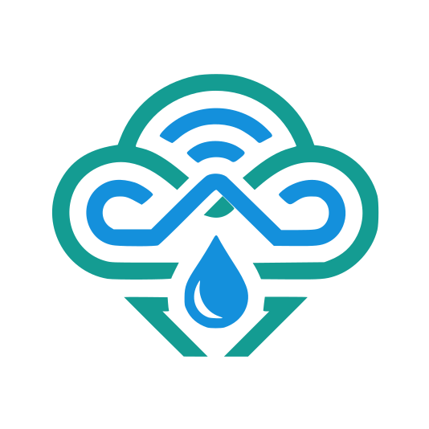
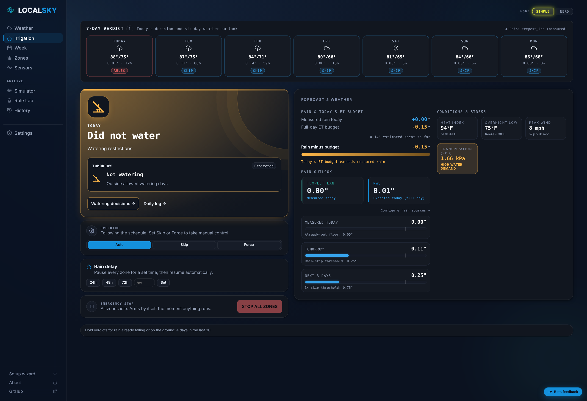
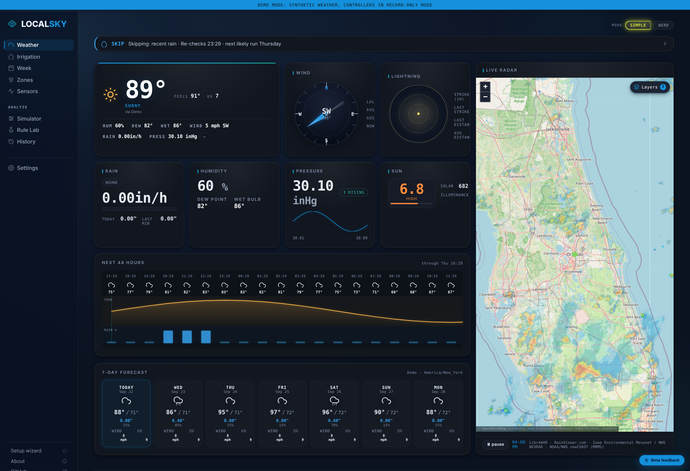

<p align="center"></p>
<h1 align="center">LocalSky</h1>
<p align="center"><strong>Weather-aware irrigation. On your hardware.</strong></p>
<p align="center">
<a href="https://demo.localsky.io">Try the demo</a> ·
<a href="https://localsky.io/docs/getting-started">Install</a> ·
<a href="https://localsky.io/docs/">Read the guide</a> ·
<a href="https://localsky.io/docs/developers">Build an integration</a>
</p>
<p align="center">
<a href="https://github.com/silenthooligan/localsky/releases/latest"></a>
<a href="https://github.com/silenthooligan/localsky/actions/workflows/ci.yml"></a>
<a href="LICENSE"></a>
</p>

LocalSky brings your weather, soil conditions, and irrigation into one app. It decides when each zone needs water, accounts for recent rain and watering, and looks ahead before scheduling the next run. You can see what happened today, what is planned next, and the reason behind each decision.

Run it on your own server, NAS, Raspberry Pi, or Home Assistant OS. Use your existing supported controller and sensors. Home Assistant is optional. There is no LocalSky cloud account or subscription.



## Start here

| I want to… | Go to |
|---|---|
| See the app before installing | [Live demo](https://demo.localsky.io) |
| Run LocalSky with Docker | [Installation guide](https://localsky.io/docs/getting-started) |
| Run it on Home Assistant OS | [LocalSky app](https://github.com/silenthooligan/localsky-apps) |
| Add LocalSky entities to Home Assistant | [Companion integration](https://github.com/silenthooligan/localsky-ha) |
| Check my controller or weather station | [Controllers](https://localsky.io/docs/controllers) · [Weather and sensors](https://localsky.io/docs/sensors) |
| Connect an automation, dashboard, or AI tool | [Developer guide](https://localsky.io/docs/developers) |

## Water for the conditions

Each zone has its own soil, plants, sprinkler rate, and limits. LocalSky uses reference evapotranspiration and a soil water balance to estimate demand. Rain and completed watering replenish that balance; soil capacity limits how much water can remain available.

The plan carries those conditions forward through the forecast. Expected rain can defer watering when the zone can wait. Restrictions, weather holds, and available watering time also shape the schedule.

**Today is a record. Tomorrow is a projection.** Open Watering decisions for the inputs and zone reasons. History shows runs, cycles, and recorded skipped mornings. Missing measurements remain unknown.

[How watering decisions work →](https://localsky.io/docs/irrigation-engine)

## Your weather, in one place

Read local stations such as Tempest and Ecowitt, use Home Assistant sensors, or connect supported online providers. Choose which source supplies each reading and its backups. The dashboard brings current conditions, forecasts, radar, and history together.

You can use LocalSky for weather alone. Add a controller when you want irrigation.



## Choose your connections

- **Local controllers:** OpenSprinkler, supported HTTP controllers, MQTT valves, and Home Assistant service calls.
- **Cloud controllers:** supported Rachio, Hydrawise, B-hyve, and Rain Bird adapters.
- **Weather and soil:** local stations and probes, HA passthrough, MQTT, HTTP ingest, and forecast providers.
- **Other software:** REST, live SSE streams, MQTT publishing, and the Home Assistant integration.

Support and testing vary by adapter. Check the [compatibility guide](https://localsky.io/docs/controllers) before choosing hardware.

Local operation depends on the connections you choose. LAN sensors and controllers can work without vendor clouds; online forecasts, radar, and cloud controllers need internet access. If required decision data becomes unavailable, automatic watering can be held. [Offline behavior →](https://localsky.io/docs/standalone)

## Install with Docker

```sh
docker run -d \
  --name localsky \
  --restart unless-stopped \
  -p 8090:8090 \
  -v localsky-data:/data \
  ghcr.io/silenthooligan/localsky:latest
```

Open **http://localhost:8090** and complete setup. Your configuration and history live in the persistent volume. For Tempest broadcasts and LAN discovery, follow the [networking instructions](https://localsky.io/docs/getting-started#networking-for-local-devices).

LocalSky is in beta. Review zone bindings, application rates, and run limits before enabling automatic watering.

## Build on LocalSky

The [developer guide](https://localsky.io/docs/developers) covers authentication, live data, forecast windows, and error handling. Download an OpenAPI definition, start with a working client, or give an AI tool a documented set of read operations.

The optional built-in AI advisor explains the engine's decisions. The irrigation engine makes those decisions.

## Help and contribute

[Documentation](https://localsky.io/docs/) · [Troubleshooting](https://localsky.io/docs/troubleshooting) · [Report an issue](https://github.com/silenthooligan/localsky/issues) · [Contributing](CONTRIBUTING.md) · [Release notes](CHANGELOG.md)

Open source under [Apache 2.0](LICENSE).
